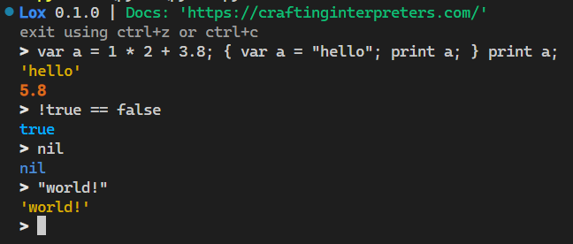
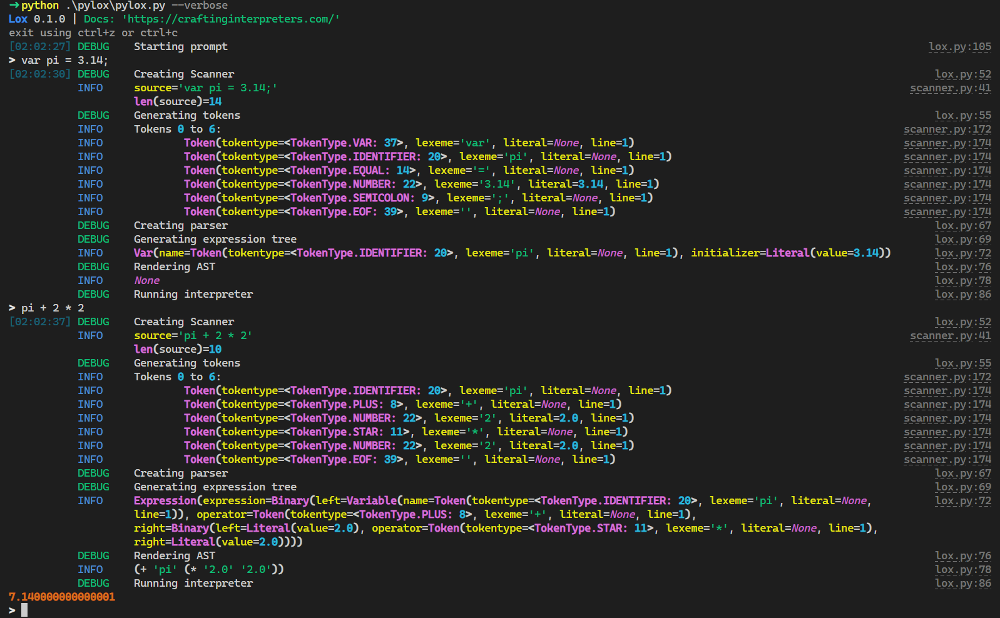
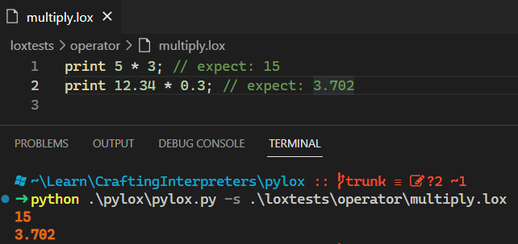

# pylox

<!-- 
 -->

Pylox is a Lox interpreter, implemented in Python, based on the book [Crafting Interpreters](https://craftinginterpreters.com/)
by Bob Nystrom.

> I am currently working through Chapter 9.

> Also, I have implemented some of the chapter challenges so far, but not all. Eventually I want to 100% the Tree-Walk Interpreter section

-----

**Table of Contents**

- [pylox](#pylox)
  - [Demo](#demo)
    - [REPL](#repl)
    - [Verbose REPL](#verbose-repl)
    - [Source files](#source-files)
  - [Installation](#installation)
  - [License](#license)

## Demo

### REPL

### Verbose REPL

Useful for debugging

### Source files

## Installation

Pull from Github

> Requires Python 3.10 or later

I use [Hatch](https://hatch.pypa.io/latest/) to manage the Python environment

## License

`pylox` is distributed under the terms of the [MIT](https://spdx.org/licenses/MIT.html) license.
