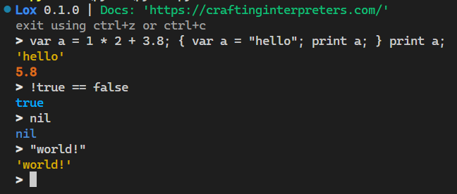
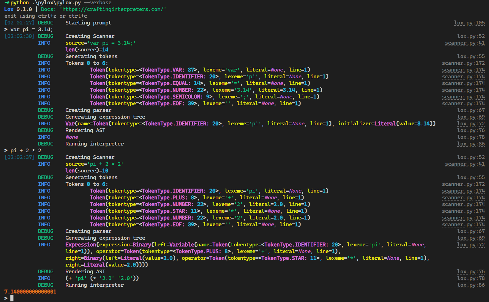
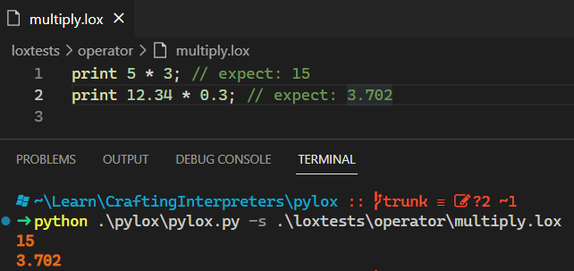

# pylox

<!-- 
 -->

Pylox is a Lox interpreter, implemented in Python, based on the book [Crafting Interpreters](https://craftinginterpreters.com/)
by Bob Nystrom.

> I am currently working through Chapter 9.

> Also, I have implemented some of the chapter challenges so far, but not all. Eventually I want to 100% the Tree-Walk Interpreter section

-----

**Table of Contents**

- [pylox](#pylox)
  - [Demo](#demo)
    - [REPL](#repl)
    - [Verbose REPL](#verbose-repl)
    - [Source files](#source-files)
  - [Installation](#installation)
  - [Challenges](#challenges)
  - [Architecture of `pylox`](#architecture-of-pylox)
  - [License](#license)

## Demo

### REPL

### Verbose REPL

Useful for debugging

### Source files

## Installation

Pull from Github

> Requires Python 3.10 or later

I use [Hatch](https://hatch.pypa.io/latest/) to manage the Python environment

## Challenges

Ch 4. Scanning

- [X] Support for C-style block comments (NOT nestable)

Ch 5. Representing Code

- [X] AST print Reverse Polish Notation

Ch 6. Parsing Expressions

- [ ] Comma Operator
- [ ] Ternary Operator
- [X] Error productions for binary operators without left-hand side expression

Ch 7. Evaluating Expressions

- [] ~~define "+" so that if one operand is string, it coerces other operand to string~~ I don't really like this behaviour with strings. Between floats and ints this is okay, but Lox anyways only has float type
- [X] handle zero division error

Ch 8. Statements and State

- [X] Evaulate expressions in REPL
- [X] Runtime error when accessing uninitialized variables

Ch 9. Control Flow

## Architecture of `pylox`

**cli**: handles command line interface (cli) options, cli formatting, stdin/stdout.

**utils**: helper utilities; not particularly significant to the function of the app, but convenient.

**engine**: the core of the pylox interpreter

## License

`pylox` is distributed under the terms of the [MIT](https://spdx.org/licenses/MIT.html) license.